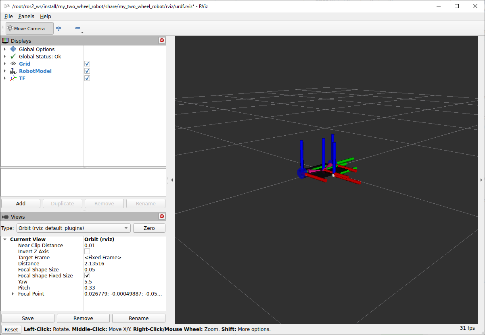

# my_two_wheel_robot

Учебная модель двухколёсного дифференциального робота для ROS 2 Jazzy. Пакет содержит Xacro-модель, конфигурацию `ros2_control`, `diff_drive_controller`, mock hardware и готовую конфигурацию RViz.



## Возможности

- двухколёсный дифференциальный привод;
- `mock_components/GenericSystem` с вычислением динамики;
- публикация состояний колёс и одометрии;
- управление через `geometry_msgs/msg/TwistStamped`;
- визуализация модели, TF и одометрии в RViz;
- звено `lidar_link`, закреплённое над платформой.

## Параметры модели

| Параметр | Значение |
|---|---:|
| Расстояние между колёсами | 0,26 м |
| Радиус колеса | 0,0325 м |
| Частота controller manager | 50 Гц |
| Максимальная линейная скорость | 2,0 м/с |
| Максимальная угловая скорость | 2,0 рад/с |
| Тайм-аут команды скорости | 0,5 с |

## Зависимости

- ROS 2 Jazzy;
- `robot_state_publisher`;
- `xacro`;
- `ros2_control` и `ros2_controllers`;
- `controller_manager`;
- `joint_state_publisher_gui`;
- `rviz2`.

Установка зависимостей рабочего пространства:

```bash
cd ~/Documents/ros2_ws
rosdep install --from-paths src --ignore-src -r -y
```

## Сборка

```bash
cd ~/Documents/ros2_ws
colcon build --packages-select my_two_wheel_robot --symlink-install
source install/setup.bash
```

## Запуск

```bash
ros2 launch my_two_wheel_robot two_wheel_robot.launch.py
```

Launch-файл запускает `robot_state_publisher`, `ros2_control_node`, `joint_state_broadcaster`, `diff_drive_controller`, `joint_state_publisher_gui` и RViz.

## Управление

Контроллер принимает `TwistStamped`:

```bash
ros2 topic pub --rate 10   /diff_drive_controller/cmd_vel   geometry_msgs/msg/TwistStamped   "{header: {frame_id: base_link}, twist: {linear: {x: 0.2}, angular: {z: 0.0}}}"
```

Для остановки завершите публикацию и отправьте нулевую команду либо дождитесь тайм-аута 0,5 с.

## ROS-интерфейсы

| Топик | Тип | Назначение |
|---|---|---|
| `/diff_drive_controller/cmd_vel` | `geometry_msgs/msg/TwistStamped` | Команда линейной и угловой скорости |
| `/diff_drive_controller/odom` | `nav_msgs/msg/Odometry` | Расчётная одометрия |
| `/joint_states` | `sensor_msgs/msg/JointState` | Состояние колёс |
| `/tf`, `/tf_static` | `tf2_msgs/msg/TFMessage` | Преобразования координат |
| `/robot_description` | `std_msgs/msg/String` | Описание модели |

## Важно

`GenericSystem` имитирует аппаратные интерфейсы и состояния, но не является полноценным физическим симулятором столкновений и контактов.

## Лицензия

Лицензия проекта пока не объявлена в `package.xml`.
